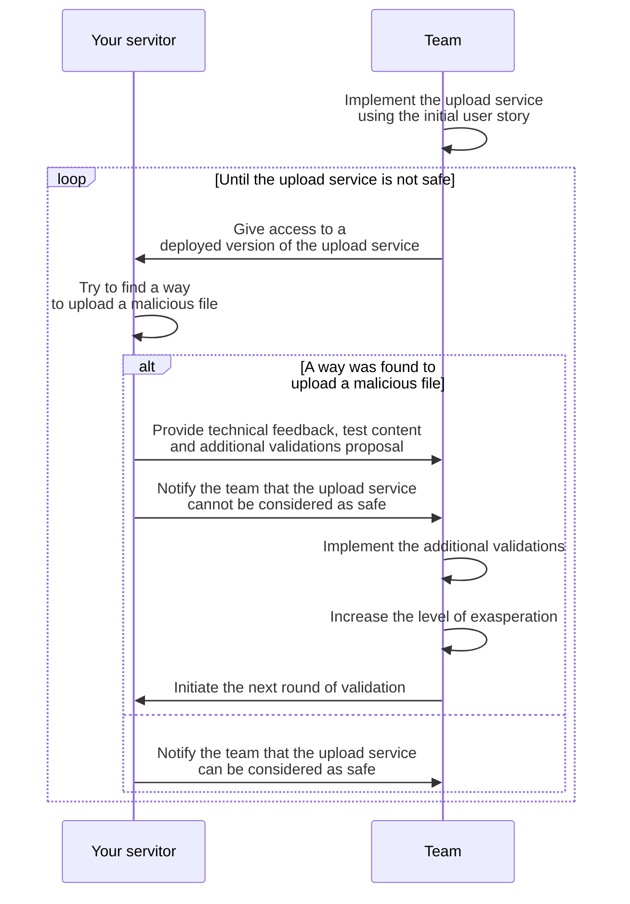
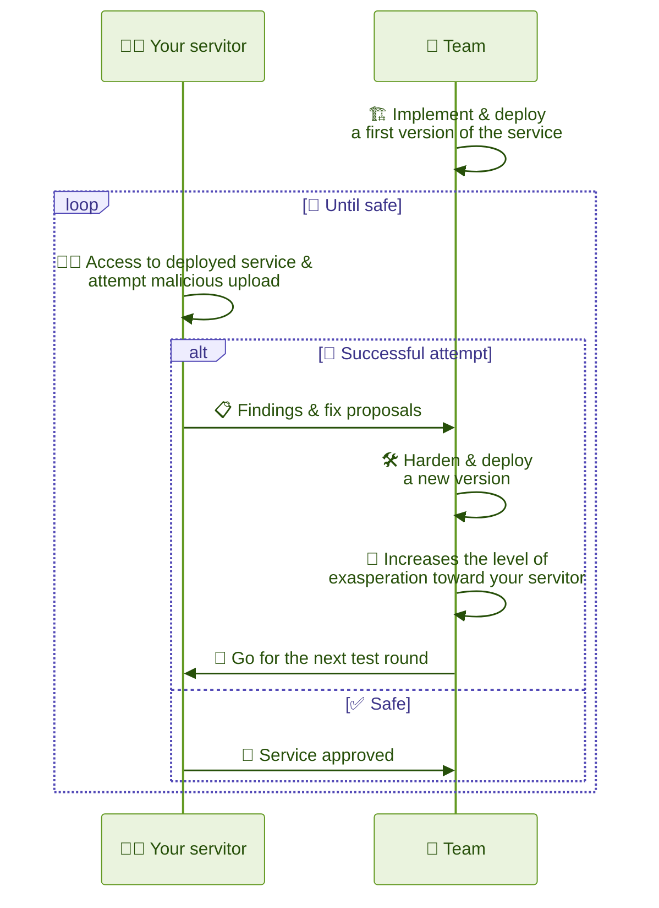

# Working process

> [!TIP]
> This [online tool](https://mermaid.live/) was used to create the schema.

```mermaid
sequenceDiagram
    participant S as Your servitor
    participant T as Team
    T->>T: Implement the upload service<br/>using the initial user story
    loop Until the upload service is not safe
        T->>S: Give access to a<br/>deployed version of the upload service
        S->>S: Try to find a way<br/>to upload a malicious file
        alt A way was found to<br/>upload a malicious file
            S->>T: Provide technical feedback, test content<br/>and additional validations proposal
            S->>T: Notify the team that the upload service<br/>cannot be considered as safe
            T->>T: Implement the additional validations
            T->>T: Increase the level of exasperation
            T->>S: Initiate the next round of validation
        else
            S->>T: Notify the team that the upload service<br/>can be considered as safe
        end
    end
```

Enhanced version thanks for Claude:

```mermaid
%%{init: {
  "theme": "base",
  "themeVariables": {
    "primaryColor": "#EAF3DE",
    "primaryTextColor": "#27500A",
    "primaryBorderColor": "#639922",
    "secondaryColor": "#E6F1FB",
    "secondaryTextColor": "#0C447C",
    "secondaryBorderColor": "#378ADD",
    "tertiaryColor": "#FAEEDA",
    "tertiaryTextColor": "#633806",
    "tertiaryBorderColor": "#BA7517",
    "noteBkgColor": "#FAEEDA",
    "noteTextColor": "#633806",
    "noteBorderColor": "#BA7517",
    "loopTextColor": "#3C3489",
    "activationBkgColor": "#EEEDFE",
    "activationBorderColor": "#534AB7",
    "signalColor": "#27500A",
    "signalTextColor": "#27500A",
    "labelBoxBkgColor": "#EEEDFE",
    "labelBoxBorderColor": "#534AB7",
    "labelTextColor": "#3C3489"
  }
}}%%
sequenceDiagram
    participant S as 🧑‍💻 Your servitor
    participant T as 👥 Team
    T->>T: 🏗️ Implement & deploy<br/>a first version of the service
    loop 🔁 Until safe
        S->>S: 🧑‍💻 Access to deployed service & <br/>attempt malicious upload
        alt 🐞 Successful attempt
            S->>T: 📋 Findings & fix proposals
            T->>T: 🛠️ Harden & deploy<br/>a new version
            T->>T: 🤬 Increases the level of<br/>exasperation toward your servitor
            T->>S: 🤝 Go for the next test round
        else ✅ Safe
            S->>T: 🎉 Service approved
        end
    end
```
